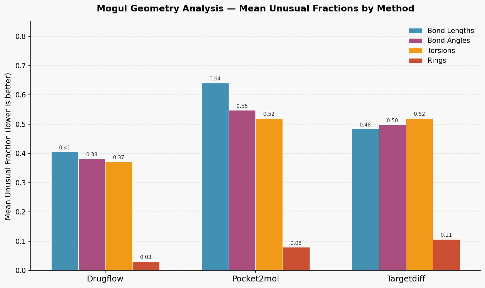

# molgeom-eval

Geometric quality analysis of molecules generated by structure-based de novo design models,
using the CSD Mogul Geometry Analyser and PoseBusters validity checks.

Accompanies this blog post: [link]

## Scripts

| Script | Environment | Description |
|---|---|---|
| `scripts/run_pb.py` | rdkit | Run PoseBusters validity checks |
| `scripts/csd_geom_check.py` | ccdc | Run Mogul geometry analysis |
| `scripts/utils.py` | rdkit | Shared utilities for loading SDF files |

## Environments

Two separate environments are required — see the blog post for full setup instructions.

**RDKit / PoseBusters**
```bash
pip install -r requirements.txt
```

**CSD / Mogul**

Requires a CCDC licence and the CSD Python API. See the blog post for setup.

## Data

100 molecules per method sampled from the CrossDocked2020 test set (one per pocket).

Methods evaluated: DrugFlow, Pocket2Mol, TargetDiff.

## Usage

Run from the project root:

```bash
# PoseBusters validity (rdkit env)
python scripts/run_pb.py

# Mogul geometry analysis (ccdc env)
python scripts/csd_geom_check.py
```

Results are saved to `results/`.

## Results

| Method | PB Pass Rate |
|---|---|
| DrugFlow | 90% |
| Pocket2Mol | 100% |
| TargetDiff | 45% |



See the blog post for full discussion.
